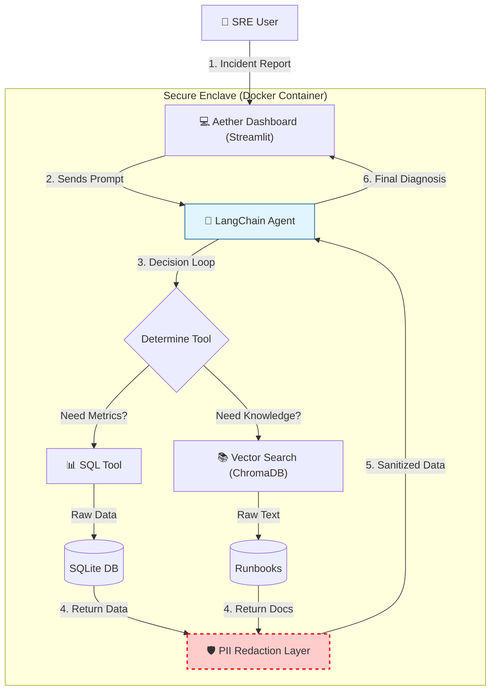

# 💠 Aether: Autonomous SRE Agent


> **"The Self-Healing Infrastructure Layer."**

Aether is an autonomous agent designed to assist Site Reliability Engineers (SREs) by reducing the Mean Time To Resolution (MTTR) for infrastructure incidents. It combines **SQL-based telemetry analysis** with **semantic search over runbooks** to diagnose issues without human intervention.

## 🏗️ Architecture



## 🚀 Key Features

* **🧠 Autonomous Reasoning Loop:** Uses Chain-of-Thought (CoT) to plan investigations (Schema Check → Query Metrics → Search Runbooks).
* **🔭 Full Observability:** integrated **OpenTelemetry** tracing to visualize the agent's decision-making process in Jaeger.
* **🛡️ PII Redaction Middleware:** Custom regex-based firewall that intercepts all database outputs to strip Emails, API Keys, and SSNs before they reach the LLM context window.
* **📊 Multi-Modal Investigation:** Correlates structured time-series data (SQLite) with unstructured institutional knowledge (ChromaDB).
* **🐳 Production Ready:** Fully containerized with Docker for consistent deployment.

## 🛠️ Engineering Optimizations & Tuning Log

The development of Aether involved solving critical production challenges common to LLM agents. Below is a log of the key optimizations implemented to ensure reliability and cost-efficiency.

### 1. Architectural Pattern: "Just-In-Time" (JIT) Agents
* **The Problem:** Global context poisoning. Queries about one service (e.g., "Payment") would bleed into subsequent queries about others (e.g., "Kafka"), causing the agent to hallucinate incorrect SQL joins.
* **The Solution:** Implemented a **JIT Agent Factory**.
    * Every user request spins up a fresh, stateless agent instance.
    * This ensures zero cross-request contamination and strictly isolated decision-making contexts.

### 2. Schema-Aware Prompt Engineering
* **The Problem:** LLMs often fail to respect Database Normalization (e.g., trying to find `service_name` in a metrics table that only has `service_id`).
* **The Solution:** A **Dynamic System Prompt** that injects the exact user query into the instructions.
    * We replaced static few-shot examples (which caused overfitting) with dynamic algebraic instructions.
    * **Technique:** `LIKE '%{extracted_service_name}%'` pattern matching forced the agent to handle fuzzy inputs (e.g., "auth" vs "Auth-Service") robustly.

### 3. Token & Cost Optimization
* **The Problem:** Large runbooks triggered `429 Rate Limit` errors and slow response times.
* **The Solution:**
    * **Safety Cap:** Hard-coded 8,000-character limits on RAG outputs.
    * **Truncation:** Implemented "Head + Tail" slicing to preserve document context without blowing up the token window.

### 4. Performance Caching
* **The Problem:** Recurring queries caused database locks and sluggish demos.
* **The Solution:** Integrated `InMemoryCache` to serve identical reasoning traces in <0.1s, dramatically improving the user experience during repetitive debugging.

### 5. Reliability Engineering
* **The Problem:** Network flakiness or LLM "stop early" behaviors.
* **The Solution:**
    * **Tenacity Retries:** Applied exponential backoff decorators (`@retry`) to handle transient failures.
    * **Strict Ordering:** Enforced tool execution order (Schema → Metrics → Runbooks) via system prompt constraints.

## ⚡ Quick Start (Docker)

The fastest way to run Aether is via Docker.

**1. Clone the repository**
```bash
git clone [https://github.com/snudurupati/ops-sentinel.git](https://github.com/snudurupati/ops-sentinel.git)
cd ops-sentinel
```

**2. Build the Image**
```bash
docker-compose build --no-cache
```

**3. Run the Container**
*(Ensure your `.env` file contains your `OPENAI_API_KEY`)*
```bash
docker-compose up
```

**4. Access the Dashboard**
Navigate to `http://localhost:8501`

## 🛠️ Tech Stack

* **Orchestration:** LangChain (OpenAI Tools Agent)
* **Interface:** Streamlit (Custom CSS)
* **Observability:** OpenTelemetry (Jaeger Exporter)
* **Database:** SQLite (Normalized Schema), ChromaDB (Vector Store)
* **LLM:** GPT-4o / GPT-4o-mini
* **Infrastructure:** Docker, Python 3.12
* **Reliability:** Tenacity (Retries), Pydantic (Data Validation)

## 🔮 Future Roadmap (V2)

* [ ] **Human-in-the-Loop:** Approval workflow before executing write operations (e.g., restarting pods).
* [ ] **GraphRAG:** Migrating from SQL Joins to a Graph Database (ArangoDB) for semantic relationship mapping.
* [ ] **RBAC:** Role-Based Access Control via OAuth2.