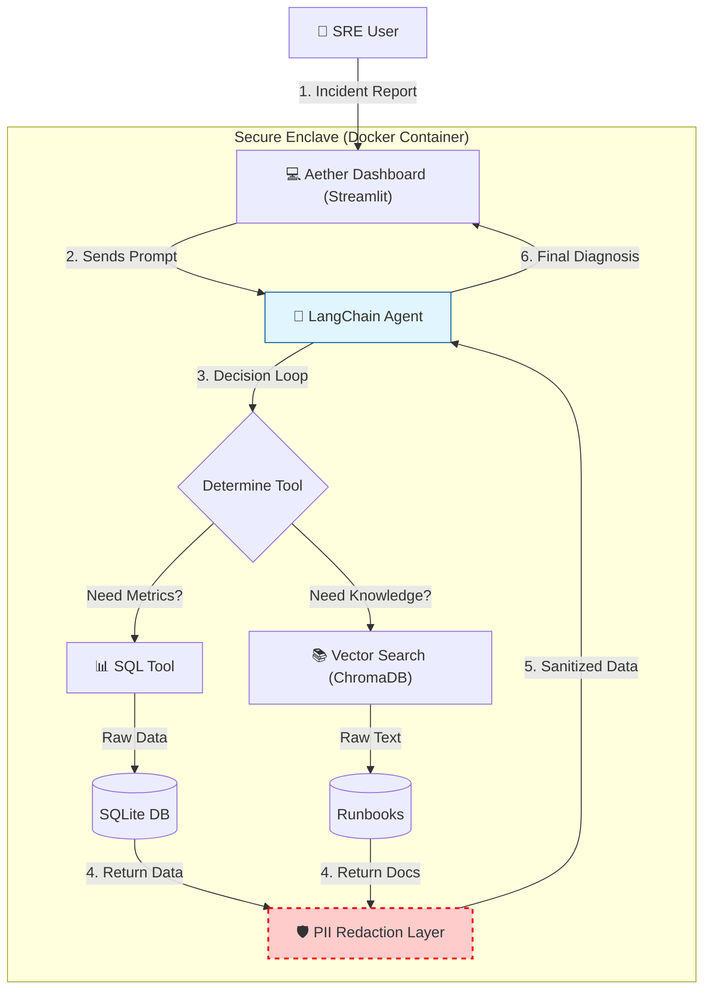

# 💠 Aether: Autonomous SRE Agent

> **"The Self-Healing Infrastructure Layer."**

Aether is an autonomous agent designed to assist Site Reliability Engineers (SREs) by reducing the Mean Time To Resolution (MTTR) for infrastructure incidents. It combines **SQL-based telemetry analysis** with **semantic search over runbooks** to diagnose issues without human intervention.

## 🏗️ Architecture

## 🚀 Key Features

* **🧠 Autonomous Reasoning Loop:** Uses Chain-of-Thought (CoT) to plan investigations (Schema Check → Query Metrics → Search Runbooks).
* **🛡️ PII Redaction Middleware:** Custom regex-based firewall that intercepts all database outputs to strip Emails, API Keys, and SSNs before they reach the LLM context window.
* **📊 Multi-Modal Investigation:** Correlates structured time-series data (SQLite) with unstructured institutional knowledge (ChromaDB).
* **🐳 Production Ready:** Fully containerized with Docker for consistent deployment.

## ⚡ Quick Start (Docker)

The fastest way to run Aether is via Docker.

**1. Clone the repository**

git clone [https://github.com/snudurupati/ops-sentinel.git](https://github.com/snudurupati/ops-sentinel.git)
cd ops-sentinel

**2. Build the Image**

docker build -t ops-sentinel:v1 .

**3. Run the Container**
*(Requires an OpenAI API Key)*

docker run -p 8501:8501 -e OPENAI_API_KEY="sk-..." ops-sentinel:v1

**4. Access the Dashboard**
Navigate to `http://localhost:8501`

## 🛠️ Tech Stack

* **Orchestration:** LangChain / LangGraph
* **Interface:** Streamlit (Custom CSS)
* **Database:** SQLite (Metrics), ChromaDB (Vector Store)
* **LLM:** GPT-4o-mini
* **Infrastructure:** Docker, Python 3.12

## 🔮 Future Roadmap (V2)

* [ ] **OpenTelemetry Integration:** Distributed tracing for agent decision steps.
* [ ] **Human-in-the-Loop:** Approval workflow before executing write operations (e.g., restarting pods).
* [ ] **RBAC:** Role-Based Access Control via OAuth2.